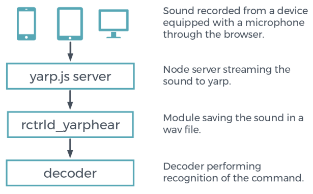

# Decoding within YARP

<kbd></kbd>

*Illustration of the overall pipeline.*

## Prerequisites

For the pipeline described here to work, the requirements are:
* portaudio should be installed. On Ubuntu, this can be achieved by
  installing the package portaudio19-dev.
* enable portaudio module in YARP (`CREATE_DEVICE_LIBRARY_MODULES=ON` and
  then `ENABLE_yarpmod_portaudio=ON`).
* the portmonitor carrier should be activated as well as lua bindings
  (following [yarp website's](http://www.yarp.it/portmonitor.html#need)
  instructions).

## Acquiring sound

To get the audio stream, we rely on [yarp.js
library](https://github.com/robotology/yarp.js), which allows to stream
audio to YARP from any  device equipped with a microphone and a web browser
(computer but also phone or tablet). Among other examples, an audio
streaming application is demonstrated that we reuse here. We simply added a
`trigger:o` port on which the commands `start` and `stop` are sent when the
streaming button is pressed.

To make this new audio streamer work, simply copy the original example and
replace the original `audio_stream` subdirectory by the one provided here.
Supposing your are in  `yarp_decoding` folder and that `$YARPJS_DIR`
contains the location of yarp.js, this can be done with following commands:

    cp -r $YARPJS_DIR/examples $YARPJS_DIR/icubrec
    cp -r ./stream_audio $YARPJS_DIR/icubrec

Now, you can start the node server using the command:

    node $YARPJS_DIR/icubrec/example.js

The server is available by default on port 3000 and can be accessed from
any device connected to the same network as the computer running the
server.

## Saving data

The decoder reads data from a file. To save the data streamed through yarp
on the disk, we use the module called `rctrld_yarphear`. This is a modified
version of the module yarphear from YARP. The original module as been
updated to:
* allow receiving commands through rpc (via port /cmd:i) instead of the
  terminal
* write logs (e.g. when saving a file) on the port `log:o`
* take an optional argument `--filename <file>` that defines the location and 
  name of the output file
* take an optional argument `--muted` that starts the module in mute

## Building the decoder

The decoder is based on the program `HVite` from HTK toolkit. We added two
ports:
* `cmd:i`: can receive a `recognize` command which triggers the decoding.
* `speech:o`: output the recognized words along with the negative log
  likelihood.

Two sets of Makefiles are available to compile HTK-related code:
* `MakefileCPU`: to compile the code on a CPU machine.
* `MakefileNVCC`: to compile the code on a machine with NVIDIA GPUs
  (specially usefull with DNNs)

On a CPU machine, the module can then be compiled in the following way:
1. Compile HTK Library.

        cd HTKLib
        make -f MakefileCPU all cd ..

2. Compile and install the decoder.

        cd HTKTools
        make -f MakefileCPU all
        ln -s $PWD/decoder ~/bin/decoder
        cd ..

The procedure is similar for the GPU version.

## Putting it all together

Instead of customizing the interfaces between the different modules for the
specific task at hand, we use port monitoring function to connect them and
keep their interfaces generic.

The application `speechrec.xml` is provided to run the modules and connect them
appropriately. It relies on two environment variables that should be set before
running yarp manager:
* `YARPJS_DIR`: should point to yarp.js installation folder.
* `MODEL_DIR`: should point to the folder where the model is stored.

CMake files are also available to install all the files (portmoniors,
application, ...) properly and simply.

